<div align="center">


# 智管-Vibe Assistant

**One window for every local AI Agent — process, memory, and network.**

[](https://github.com/Zafer-Liu/Vibe_Assistant/releases)
[](LICENSE)
[](https://github.com/Zafer-Liu/Vibe_Assistant/stargazers)
[](https://github.com/Zafer-Liu/Vibe_Assistant/actions)
[](#install)
[](https://tauri.app)
[](https://react.dev)
[](https://www.rust-lang.org)
[](https://88api.ai/sign-up?aff=VNNV)

[✨ Highlights](#highlights) · [🧠 Memory Center](#memory) · [⚙️ Install](#install) · [🚀 Quick Start](#quickstart) · [❓ FAQ](#faq)

**[简体中文](./README_ZH.md)** | English

</div>

---

<a id="sponsors"></a>

## 💖 Sponsors

Thanks to **[88API](https://88api.ai/sign-up?aff=VNNV)** for sponsoring this project! 88API is a one-stop multi-model API platform operated by a Hong Kong company, built for developers, creators, and AI app users. It exposes a unified interface to text, image, voice, and video models — covering AI programming, smart translation, content creation, dubbing, image generation, and video generation in common workflows. You can add and switch providers directly inside Vibe Assistant, with international payment methods, invoices, and enterprise-grade reliability. **[Sign up via this link](https://88api.ai/sign-up?aff=VNNV)** to get an exclusive bonus credit!

<p align="center">
  <a href="https://88api.ai/sign-up?aff=VNNV">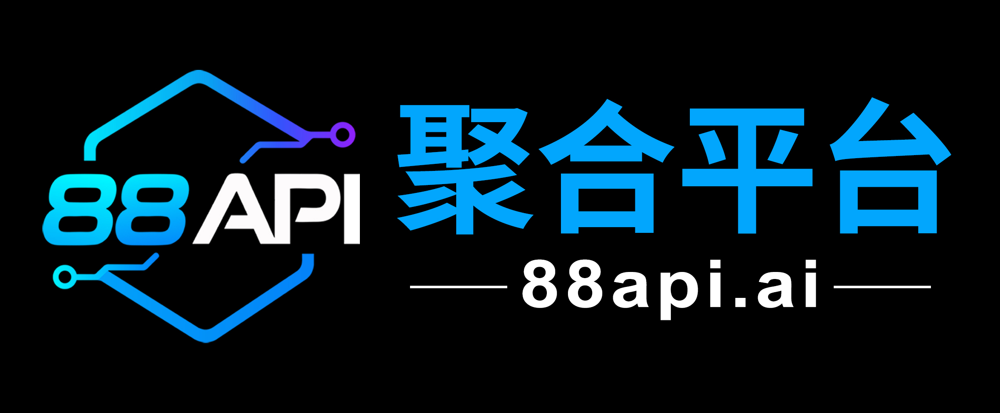</a>
</p>

---


## ✨ Highlights

**智管-Vibe Assistant** is a Tauri 2 + React 19 + Rust desktop app built around one idea: **every local Agent, managed from one window.**

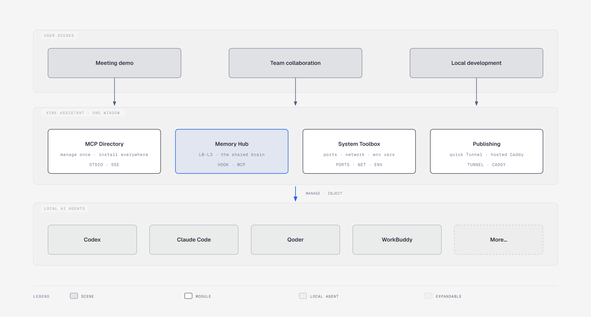

- **Launch & monitor** any local Agent — one-click start/stop, streaming logs, embedded Web UI tabs and an interactive terminal. No extra terminals, no memorized commands.
- **One shared brain** — a layered memory system (L0–L3) that captures knowledge from every coding Agent session, distills it, and injects it back automatically.
- **Publish to the internet in one click** — temporary Cloudflare Tunnel links for demos, Caddy reverse proxy for long-term hosting.
- **A real system toolkit** — port manager, network monitor with speed test, and a user/system environment variable editor.
- **Full English / Chinese UI** with live language switching.

---

## 📑 Table of Contents

- [Agent Management](#agents)
- [MCP Server Center](#mcp)
- [Proxy Publishing & Sharing](#share)
- [System Toolkit](#system)
  - [Port Manager](#ports)
  - [Network Manager](#network)
  - [Environment Variables](#env)
- [Memory Center — Cross-Agent Layered Memory](#memory)
- [Mobile Read-Only Status](#mobile)
- [Install](#install)
- [Quick Start](#quickstart)
- [LLM Configuration](#llm-config)
- [Supported Project Types](#project-types)
- [Data Storage Paths](#data-paths)
- [Telemetry & External Access](#telemetry)
- [What's New](#whats-new)
- [FAQ](#faq)
- [Contributing](#contributing)
- [License](#license)

---

<a id="agents"></a>

## 🤖 Agent Management

### Auto-detected project types

Pick a project directory and Vibe Assistant detects the stack and fills in the start command for you — Python (uv / FastAPI / Django / Streamlit / Flask), Node.js, Rust, Go, global npm CLIs, or plain executables. Port numbers are auto-discovered from `.env` files, `pyproject.toml` scripts, and source code. See [Supported Project Types](#project-types).

### Launch & monitor


- One-click start / stop of Agent processes
- Streaming stdout + stderr logs with auto-scroll
- PID, port status, and uptime at a glance
- Drag-to-reorder in the sidebar
- **Auto-detected CLIs**: installed Claude Code / Codex / Qoder / Kimi / Copilot CLIs are detected and can be imported as Agents in one click — on the Agents page and in the first-run wizard
- **Install from GitHub**: paste a repository URL to clone and prefill the config; an optional GitHub token (Settings) supports private repos and rate limits

### Embedded Web UI


Agents with a web interface (Streamlit, Flask, FastAPI, …) open inside the app — no browser switching:

- Multiple Agent UIs in tabbed views with a resizable tab bar
- One-click fullscreen
- Per-Agent UI token, appended automatically (`#token=…`) for web UIs that accept one

TUI Agents (Claude Code, Codex CLI, …) open in an embedded interactive terminal.

### First-run onboarding & updates

- A first-run wizard walks through importing detected CLIs and configuring the extraction model; it can be reopened anytime from Settings
- Built-in update checker (auto-check on launch, manual check from the sidebar)

---

<a id="mcp"></a>

## 🔌 MCP Server Center

A single catalog for MCP servers on your machine — manage them once, distribute everywhere.

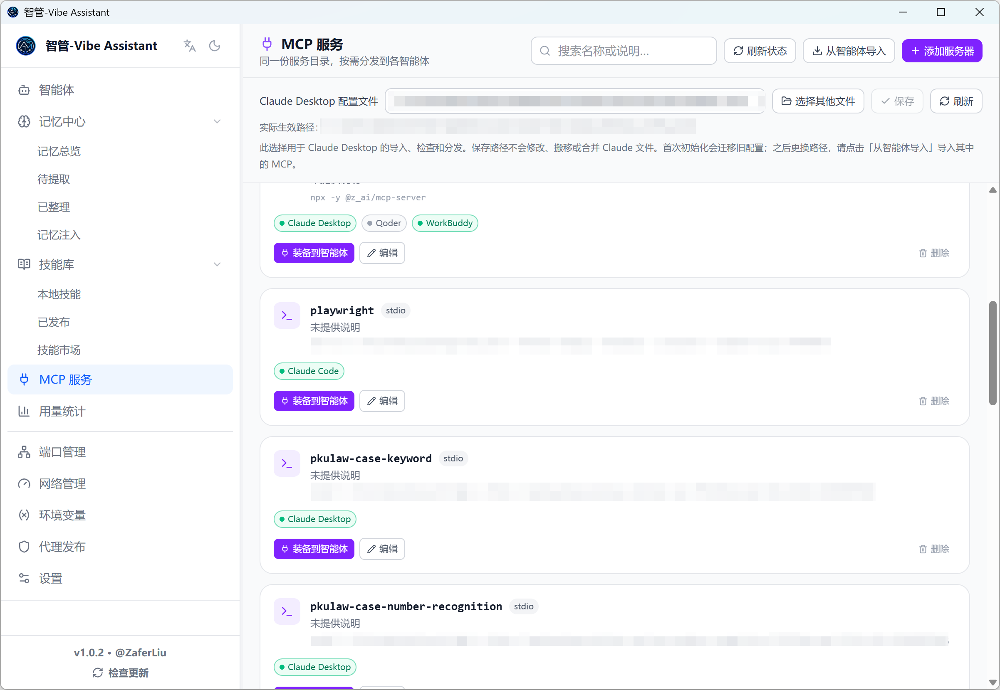

**Local server management**

- **Local scan**: auto-detects npm-global MCP packages
- **Smart parsing**: paste any text (docs, install instructions) and AI extracts the config
- **Manual entry**: stdio / SSE configurations

**Catalog & distribution**

- Keep frequently used MCP servers as catalog entries
- One-click install into Claude Code, Claude Desktop, Codex CLI, Codex Desktop, Qoder, WorkBuddy, MiniMax Code, Kimi, ZCode, and more
- Import from Agents' existing configs; per-host install status shown live (installed / config drift)

---

<a id="share"></a>

## 🌐 Proxy Publishing — Share an Agent with the World

No fixed IP, no domain, no server needed. Two paths from localhost to the public internet:

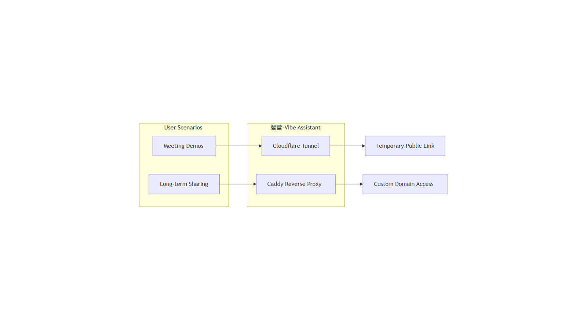

### 🔗 Temporary sharing (recommended for demos)

One click generates a temporary public link:

```
your machine localhost:5001
        ↓ Cloudflare Tunnel
https://abc-xyz.trycloudflare.com  ← send to a colleague
```

1. Install cloudflared (see below)
2. Start the Agent
3. Open **Proxy Publishing** → pick the Agent → click **Generate Link**
4. Wait 5–15 s for the `https://xxx.trycloudflare.com` URL
5. Close the tunnel when the meeting ends — the link dies instantly

```powershell
# Windows (Scoop recommended)
scoop install cloudflared

# macOS
brew install cloudflared
```

Or download the binary from [cloudflared Releases](https://github.com/cloudflare/cloudflared/releases/latest).

> ⚠️ Temporary links have no access control. Keep them open only as long as needed.

### 🛡️ Caddy reverse proxy (long-term hosting)

For fixed domains and continuous availability:

- Custom domains with automatic HTTPS certificates
- Username / password access control (bcrypt-hashed)
- Per-rule user permissions
- One-click Caddyfile generation, start, and reload

---

<a id="system"></a>

## 🧰 System Toolkit

<a id="ports"></a>

### Port Manager

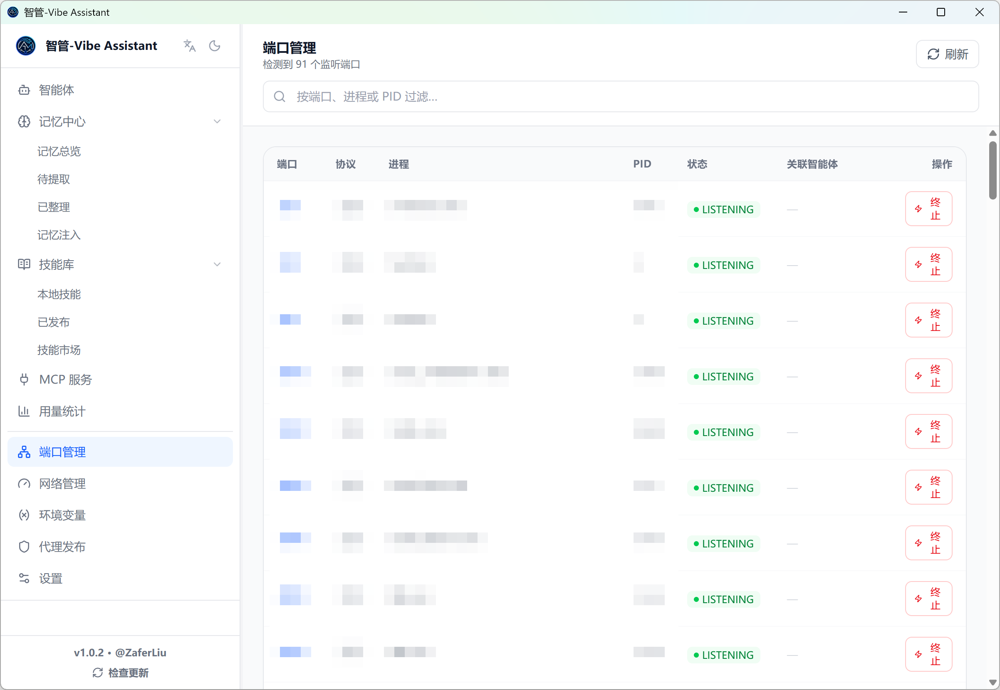

- Every listening port with protocol, PID, and process name
- Kill the process occupying a port in one click — the fastest way to diagnose "port already in use" startup failures

<a id="network"></a>

### Network Manager

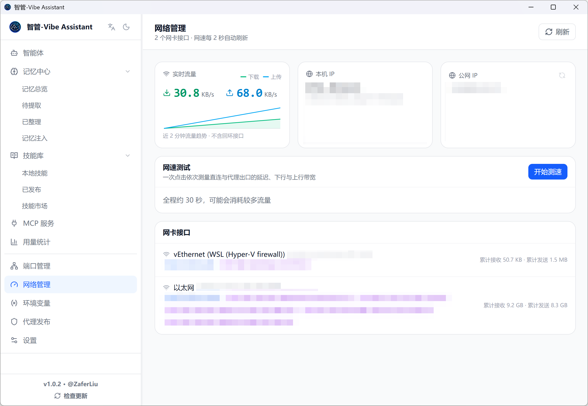

- **Live throughput** per network interface, with a rolling download/upload chart
- **Interface list** with IPv4 / IPv6 addresses, MAC, and MTU
- **Public IP** for both direct and proxy egress (detects your proxy automatically)
- **Bandwidth speed test** — latency, download, and upload over both direct and proxy paths

<a id="env"></a>

### Environment Variables

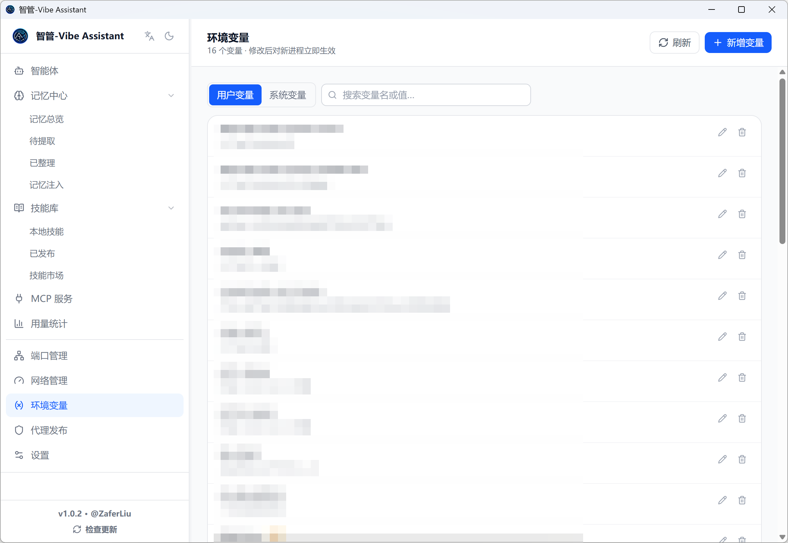

The equivalent of Windows' "Edit environment variables" dialog, without opening the registry editor:

- **User and system** scopes in separate tabs (system changes need an administrator-run app)
- **PATH-style variables are edited one entry per line** — add, remove, and reorder paths visually instead of fighting a semicolon blob
- Values containing `%REFERENCES%` are stored as `REG_EXPAND_SZ` with an expanded-value preview
- Changes are broadcast (`WM_SETTINGCHANGE`) so newly started processes pick them up immediately
- Critical variables (PATH, PATHEXT, WINDIR, …) are protected from accidental deletion

---

<a id="memory"></a>

## 🧬 Memory Center — One Brain for All Agents

Every coding Agent you use remembers your preferences, decisions, and current work — and every other Agent benefits from it.

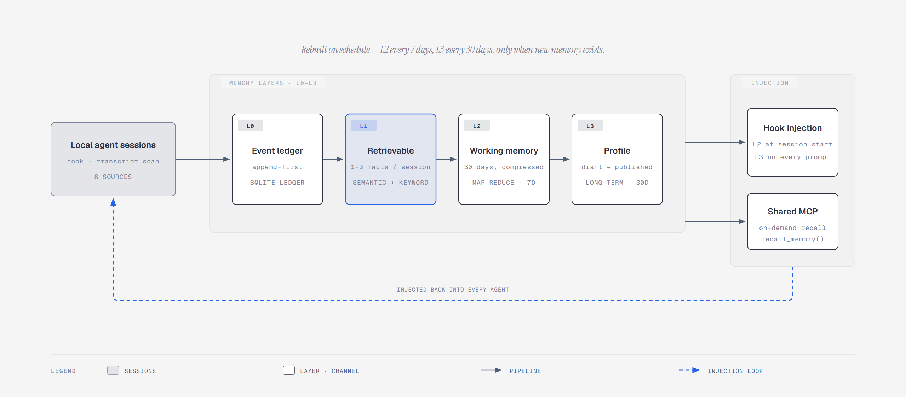

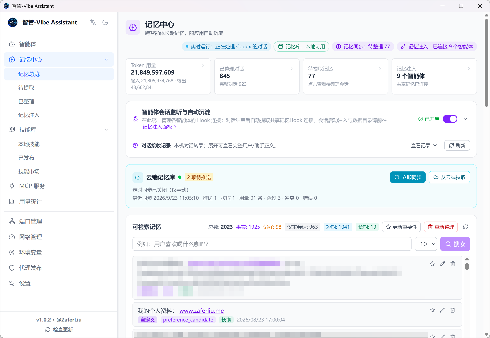

### The L0–L3 memory model

| Layer | Name | Source | Role |
|-------|------|--------|------|
| L0 | Event ledger | Hook events / local transcript scans | Audit source; never injected as a whole |
| L1 | Retrievable memories | 1–3 facts / decisions / constraints / preferences extracted at session end | Semantic + keyword recall on demand |
| L2 | 30-day working memory | Map-reduce compression of recent L1 evidence | Injected at session start |
| L3 | Long-term Profile | Drafted from L2, gated by review before publishing | Injected every turn — stable preferences and constraints |

### 📥 Automatic capture (Agents → memory)

- Supports **Codex, Claude Code, Qoder, WorkBuddy, MiniMax Code, Kimi, GitHub Copilot, and ZCode** — via hooks (the first four) or local transcript scanning (all eight)
- Sessions land in a local SQLite ledger first, extraction runs async — nothing is lost when offline or before a model is configured; failed sessions can be re-run manually
- **Pending Memories** and **Organized Conversations** panels show full conversations, extraction progress, and failure reasons
- L1 cleaning & dedup ("dreaming"): local BGE semantic candidates + LLM arbitration, with rollback checkpoints
- **Import from a folder**: point the app at any transcript folder and extract memories from it directly

### 🔎 Search, ranking & the memory engine

- **Semantic search** across all L1 memories (hybrid semantic + keyword) right in the Memory Center
- **Importance ranking**: every memory gets a score with its evidence (supporting sessions, Agents, recall count); pin what matters
- **Memory engine**: the optional local semantic sidecar (status visible in the Memory Center) can be started / stopped on demand
- Inline edit / delete of any memory, plus manually added entries
- Reset-all-for-re-extraction when you want a clean rebuild of L1

### ⏱️ Scheduled L2/L3 refresh

The published L2 working memory and L3 Profile no longer depend on clicking buttons:

- Checks every 30 minutes while the app runs; rebuilds **L2** when new memories arrived and the configured interval (default **7 days**) elapsed
- Rebuilds and **auto-publishes L3** when L2 changed and its interval (default **30 days**) elapsed
- Intervals and the on/off switch live in **Settings → Scheduled memory refresh**; changes apply immediately
- Every background run is logged on the Memory Injection page; manual consolidation still works anytime

### 💉 Memory injection (memory → Agents, dual channel)

| Channel | Mechanism | Best for |
|---------|-----------|----------|
| Hook injection | SessionStart injects L2 once; UserPromptSubmit injects L3 every turn (content-fingerprint gated — unchanged turns cost zero tokens) | Working context at start, durable preferences throughout |
| Shared-memory MCP | Agents call `recall_memory` for semantic search on demand | Task-specific recall without bloating context |

**One-click setup**: install / uninstall the shared-memory MCP into **Claude Code, Claude Desktop, Codex CLI, Codex Desktop, Qoder, WorkBuddy, MiniMax Code, Kimi, ZCode**, and manage capture/injection hooks for the four hook-capable Agents (Claude Code, Codex, Qoder, WorkBuddy). Per-device data directory overrides are supported.

### ✍️ Custom memories

Hand-written entries under the working-memory or long-term cards — only you can edit or delete them, automatic cleaning never touches them, and they are always injected.

### 📚 Shared Skill library & marketplace

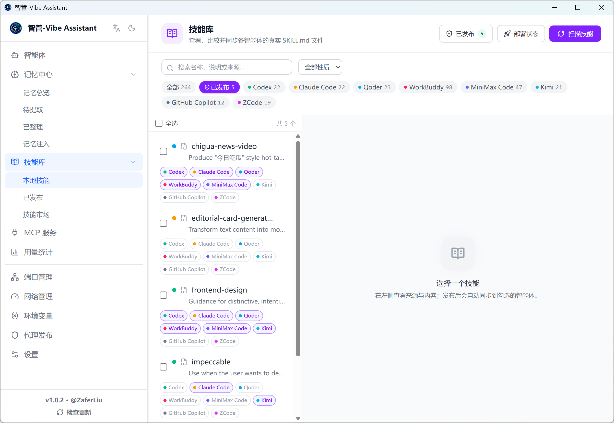

- **Skill library**: scans each Agent's `SKILL.md` files into a shared library; content-hash previews of adds / updates / conflicts before you confirm a sync; "publish + equip" in one step, with bulk operations, per-Agent version drift detection, one-click rollback of the latest publish, and "adopt local" to take an Agent's local edit as the new shared version
- **Marketplace**: browse and install curated skills from the official **OpenAI** and **Anthropic** skill repositories — downloads are size-bounded, every relative path validated, and downloaded scripts are never executed

### 📊 Token usage analytics

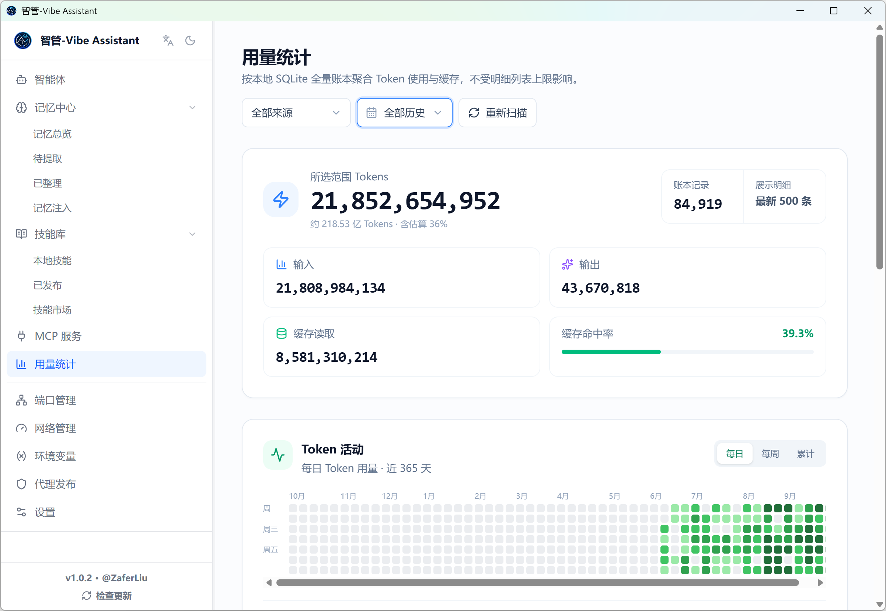

Aggregates real input / output / cache usage from local transcripts across Agents — coverage includes Codex, Claude Code, Qoder, WorkBuddy, MiniMax Code, Kimi, GitHub Copilot, Gemini CLI, OpenCode, OpenClaw, and more — aligned with how providers bill:

- Summary dashboard plus per-session usage records and live session activity
- Injection dashboard: per-source session/prompt injection counts, fingerprint-gate hit rate, and estimated token cost

### ☁️ Cloud Memory Vault (optional)

Sync published L2/L3 documents and custom memories across machines — one brain everywhere:

- **AES-256-GCM end-to-end encryption**: keys derived from your sync password, never stored; the server only ever sees ciphertext
- CAS conflict detection, incremental pulls, tombstone deletions; local SQLite stays authoritative, offline sync failures never block injection
- Single-file self-hostable server, open source in [`vault/`](vault/README.md) — Docker / Railway / Orange Pi + Tailscale

---

<a id="mobile"></a>

## 📱 Mobile Read-Only Status

Enable in **Settings → Mobile status**: a token-protected page served on your LAN shows running / needs-attention / completed Agent tasks, refreshing every 5 seconds — check on long-running work from your phone without exposing any mutating action.

---

<a id="install"></a>

## ⚙️ Install

### Download a prebuilt package (recommended)

Grab the latest from [Releases](https://github.com/Zafer-Liu/Vibe_Assistant/releases):

| Platform | Package |
|----------|---------|
| Windows x64 | `-x64-setup.exe` (NSIS installer) |
| macOS Apple Silicon | `-aarch64.dmg` |
| macOS Intel | `-x64.dmg` |
| Linux x64 | `-amd64.AppImage` / `-amd64.deb` |

### Build from source

**Prerequisites**: [Node.js](https://nodejs.org) ≥ 18, [Rust](https://rustup.rs) stable, and the [Tauri prerequisites](https://tauri.app/start/prerequisites/) (VS C++ Build Tools on Windows).

```bash
git clone https://github.com/Zafer-Liu/Vibe_Assistant.git
cd Vibe_Assistant

# install dependencies
npm install
cd frontend && npm install && cd ..

# development
npm run dev

# production build
npm run build
```

Bundles land in `src-tauri/target/release/bundle/`.

---

<a id="quickstart"></a>

## 🚀 Quick Start

### 1. Add an Agent

1. **Agents** in the sidebar → **＋ New Agent** (top right)
2. Pick the project directory (or switch to **Install from GitHub** and paste a repo URL)
3. The start command is auto-filled — adjust if needed, set the port for web-UI Agents → **Save**
4. Press ▶ to launch

### 2. Open the Agent

- Web UI Agents (Streamlit / Flask / …): **Open UI** → embedded tab
- TUI Agents (Claude Code / Codex): **Open Terminal** → embedded terminal

### 3. Turn on the Memory Center (optional)

1. **Settings → LLM and memory extraction** — confirm the extraction model (Ollama local models supported)
2. **Memory Center → Memory Injection** — install hooks / the shared-memory MCP for your Agents
3. Use your Agents normally; memories accumulate automatically, L2/L3 keep themselves fresh on schedule

### 4. Share an Agent (optional)

1. Install cloudflared
2. **Proxy Publishing** → pick the Agent → **Generate Link** → copy & send

---

<a id="llm-config"></a>

## 🤖 LLM Configuration

MCP parsing and memory extraction need an LLM. Add one under **Settings → LLM and memory extraction**:

| Field | Meaning | Example |
|-------|---------|---------|
| Name | Anything you like | DeepSeek |
| Base URL | Any OpenAI-compatible API | `https://api.deepseek.com/v1` |
| API Key | Provider API key | `sk-xxx` |
| Model | Model name | `deepseek-chat` |

Hit **Test Connection** — green means good.

**Built-in presets**: DeepSeek (`deepseek-chat`), OpenAI (`gpt-4o-mini`), or any custom OpenAI-compatible endpoint. Keys are encrypted at rest (AES-256-GCM, machine-bound).

**Local models (Ollama)**: the settings page has a built-in Ollama module — connect, list pulled models with size / quantization, and promote one to a custom provider or the memory-extraction model in one click.

---

<a id="project-types"></a>

## 🔍 Supported Project Types

| Type | Detection | Generated command |
|------|-----------|-------------------|
| Python · uv | `pyproject.toml` + `uv.lock` | `uv run python main.py` |
| Python · FastAPI | `fastapi` in requirements | `uvicorn main:app --reload --port PORT` |
| Python · Django | `manage.py` exists | `python manage.py runserver 0.0.0.0:8000` |
| Python · Streamlit | `streamlit` in requirements | `streamlit run app.py --server.port 8501` |
| Python · Flask | `flask` in requirements | `python app.py` |
| Python · generic | `main.py` / `app.py` … | `python main.py` |
| Node.js | `package.json` | `npm run dev` |
| Rust | `Cargo.toml` | `cargo run` |
| Go | `go.mod` | `go run .` |
| npm global CLIs | `%APPDATA%\npm\*.cmd` | interactive PowerShell with auto-typed command |
| Executables | `.exe` / `.bat` / `.cmd` / `.sh` | run directly |

Port numbers are auto-detected from `.env` files, `pyproject.toml` scripts, and `port=` assignments in source.

---

<a id="data-paths"></a>

## 📁 Data Storage Paths

| Data | Windows | macOS / Linux |
|------|---------|---------------|
| Agent configs | `%APPDATA%\agent-manager\agents.json` | `~/Library/Application Support/agent-manager/` (macOS), `~/.local/share/agent-manager/` (Linux) |
| LLM providers | `%APPDATA%\agent-manager\llm_config.json` | same directory |
| Memory & telemetry DB | `%APPDATA%\agent-manager\telemetry.sqlite3` | same directory |
| Agent source overrides | `%APPDATA%\agent-manager\agent_source_paths.json` | same directory |
| Generated Caddyfile | `%APPDATA%\agent-manager\Caddyfile` | same directory |
| Claude Desktop MCP config | `%APPDATA%\Claude\claude_desktop_config.json` | `~/Library/Application Support/Claude/claude_desktop_config.json` |

The Settings page offers one-click **export / import** of a full config backup for migration and disaster recovery.

---

<a id="telemetry"></a>

## 🔌 Telemetry & External Access (experimental)

The memory pipeline uses local SQLite as its event ledger: hook events are persisted first and extracted asynchronously, so an offline model never loses captured sessions.

- **Codex, Claude Code, Qoder**: per-Agent hooks install/uninstall from the Memory Center; port and auth follow the external-trigger settings
- **WorkBuddy**: never writes to its Claude Code config (no double capture); can submit aggregated session / usage data via the standard telemetry endpoint
- **Token accounting**: Codex, Claude, and WorkBuddy read real usage from local transcripts; sources without complete provider usage show clearly-marked local estimates. Stray hook events are audit-only and never double-counted; adapters can overwrite estimates with real final numbers via `session_usage`

Standard endpoint: `POST http://127.0.0.1:<hook-port>/telemetry/events/{codex|workbuddy|claude|qoder}`

```json
{
  "session_id": "stable-session-id",
  "event": "session_usage",
  "cwd": "D:/Github-repo/example",
  "usage": { "input_tokens": 120, "output_tokens": 48, "cached_tokens": 60 },
  "usage_scope": "session"
}
```

`input_tokens` must be the session's full input total; `cached_tokens` is display-only detail (do not add it into totals). Re-submissions for the same `source + session_id` overwrite instead of accumulate.

### External task dispatch

The same local server can push tasks to any HTTP-capable Agent and collect results — external systems drive your Agents without touching the UI:

| Endpoint | Purpose |
|----------|---------|
| `POST /agent/dispatch` | Send a task to an Agent's HTTP URL (async, 202) |
| `POST /agent/submit` | An Agent reports its result back |
| `GET /agent/tasks` | List in-flight tasks (dispatched / submitted / failed) |
| `GET /agent/results` | Collected results |

---

<a id="whats-new"></a>

## 🗺️ What's New

> **Current version `v1.0.2`**

- ✅ **Project renamed to Vibe Assistant** (智管-Vibe Assistant) — display name, prompts, docs, and window title; protocol identifiers and data paths unchanged, so existing hooks, MCP installs, and local data keep working
- ✅ **Environment Variables manager** — user/system scopes, PATH edited one entry per line, `REG_EXPAND_SZ` previews, protected critical variables
- ✅ **Scheduled L2/L3 memory refresh** — configurable intervals (default L2 7 days / L3 30 days), model calls only when new memories exist, L3 auto-publish
- ✅ **Network Manager** — live per-interface throughput, public-IP (direct + proxy egress) and dual-path bandwidth speed tests
- ✅ **Skill Marketplace** — install curated skills from official OpenAI / Anthropic repositories into the shared Skill library
- ✅ **Mobile read-only status page** — LAN-accessible, token-protected task status
- ✅ **Workflow feature removed** — the visual workflow builder, task board, and run history were retired to keep the app focused (see release notes for history)
- ✅ **L1 extraction hardening** — truncated-JSON salvage, contract-drift tolerance, and model-output excerpts in error messages for diagnosable failures

📖 [Full changelog](https://github.com/Zafer-Liu/Vibe_Assistant/releases)

---

<a id="faq"></a>

## ❓ FAQ

<details>
<summary><b>🧬 Memory Center</b></summary>

<details>
<summary><b>A session never became a memory?</b></summary>

Check in order:

1. Memory extraction needs an LLM: confirm at least one provider passes **Test Connection** in **Settings → LLM and memory extraction** (or an Ollama model is attached)
2. Open **Memory Center → Pending Memories** — is the session queued? What is the failure reason? (Failures quote the model's raw output for diagnosis.)
3. Confirm the Agent's capture hook is installed, or its transcript directory is configured correctly
4. Failed sessions can be re-run from the panel

</details>

<details>
<summary><b>Edits to the L3 Profile don't take effect?</b></summary>

L3 uses a draft → publish gate: a draft must be **published** before it is injected. Published profiles can be edited directly — changes apply immediately. If retrieval via MCP returns stale content, confirm the host's shared-memory MCP is connected.

</details>

<details>
<summary><b>How often are L2 / L3 refreshed?</b></summary>

On schedule, without any clicks: every 30 minutes the app checks whether new memories arrived and whether the configured interval (default L2 7 days, L3 30 days) elapsed. Adjust or disable under **Settings → Scheduled memory refresh**. Every run is logged on the Memory Injection page.

</details>

<details>
<summary><b>Cloud Vault sync conflict?</b></summary>

Local SQLite is always authoritative; a unreachable vault never blocks injection. On conflict the app asks which side to keep. The server only stores AES-256-GCM ciphertext and cannot read or alter content.

</details>

</details>

<details>
<summary><b>📦 Agent Management</b></summary>

<details>
<summary><b>The Agent status shows an error after launch?</b></summary>

Check the Agent detail logs — usually one of:

- Port occupied: find and kill the holder in Port Manager
- Dependencies missing: run the start command once in a terminal to see the real error
- Wrong working directory: verify the path in the Agent config

</details>

<details>
<summary><b>The embedded Web UI is blank?</b></summary>

The Agent is probably still booting (port not listening yet). Wait a few seconds and hit refresh in the UI toolbar.

</details>

<details>
<summary><b>The Claude Code terminal opens blank?</b></summary>

Normal: the app starts PowerShell, waits ~800 ms, then types `claude` into stdin. The TUI renders 1–2 seconds later.

</details>

<details>
<summary><b>The auto-detected Python command is wrong?</b></summary>

Detection is file-scan heuristics; edit the command in the Agent form. Changes apply on save.

</details>

</details>

<details>
<summary><b>🌐 Sharing</b></summary>

<details>
<summary><b>"Generate Link" never produces a URL?</b></summary>

1. cloudflared missing or not on PATH → click re-detect
2. Network blocked → cloudflared must reach Cloudflare
3. Agent not running → the tunnel forwards to a local port

</details>

<details>
<summary><b>Colleagues see "This site can't be reached"?</b></summary>

Confirm the Agent is actually running, the tunnel is still open (green URL in the app), and the link is the full `https://xxx.trycloudflare.com`.

</details>

<details>
<summary><b>Caddy not found / apply fails?</b></summary>

```powershell
scoop install caddy   # Windows
brew install caddy    # macOS
```

Then hit refresh on the Proxy Publishing page.

</details>

</details>

<details>
<summary><b>⚙️ Install & Runtime</b></summary>

<details>
<summary><b>Windows: "Unknown publisher" warning?</b></summary>

Click **More info → Run anyway** — the installer is not Microsoft code-signed.

</details>

<details>
<summary><b>macOS: "can't be opened because it is from an unidentified developer"?</b></summary>

```bash
xattr -d com.apple.quarantine /Applications/智管-Vibe\ Assistant.app
```

Or right-click the app → **Open** → **Open** again.

</details>

<details>
<summary><b>npm run dev says the port is in use?</b></summary>

The dev server uses port **1420**. Find and kill the holder:

```powershell
netstat -ano | findstr :1420
taskkill /PID <PID> /F
```

</details>

<details>
<summary><b>I renamed/updated the app and the shared-memory MCP stopped working?</b></summary>

A renamed install changes the executable path recorded in Agents' MCP configs. Open **Memory Center → Memory Injection** and reconnect the affected hosts once — after that, regular in-place updates keep working.

</details>

</details>

---

<a id="contributing"></a>

## 🤝 Contributing

PRs and issues are welcome:

1. **Fork** the repository
2. Create a feature branch (`git checkout -b feature/amazing-feature`)
3. Commit (`git commit -m 'feat: add amazing feature'`)
4. Push (`git push origin feature/amazing-feature`)
5. Open a **Pull Request**

Bugs and ideas: [Issues](https://github.com/Zafer-Liu/Vibe_Assistant/issues). For a dev setup see [Build from source](#install).

---

<a id="license"></a>

## 📄 License

[Apache 2.0](LICENSE)

---

<div align="center">

## ⭐ The Goal

**Let the assistant run the Agents — keep your time for what matters.**

</div>
