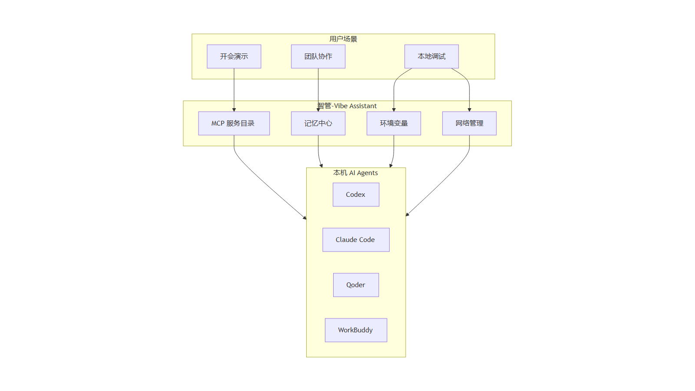
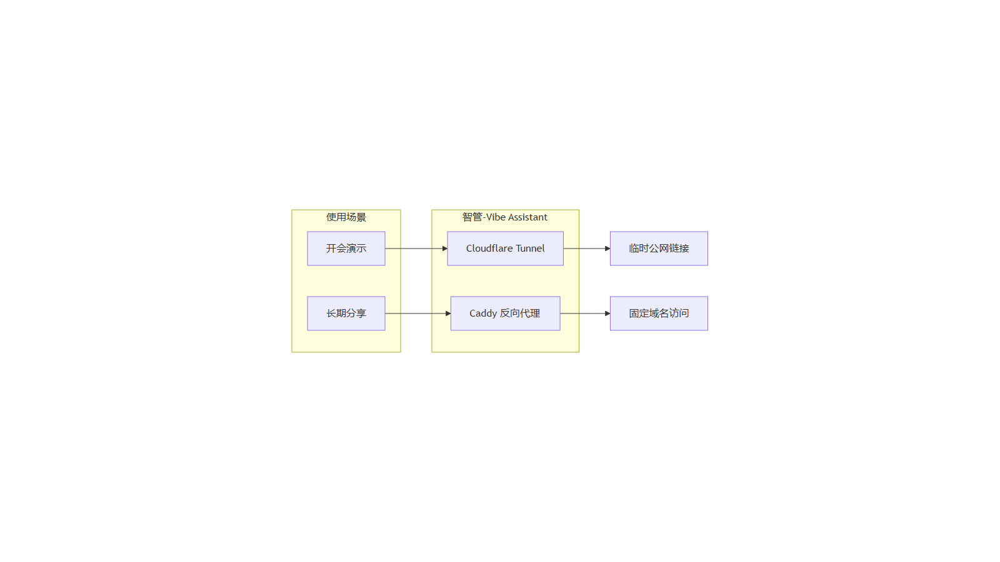
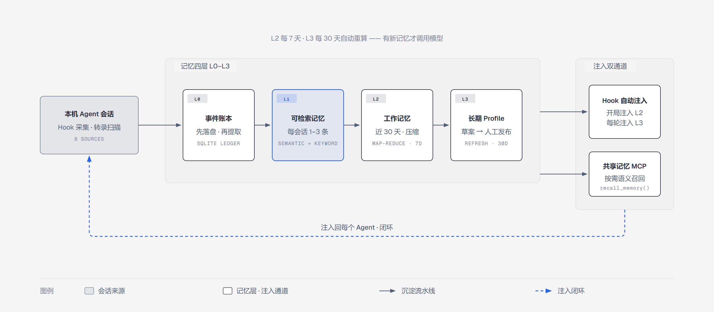

<div align="center">


# 智管-Vibe Assistant

**一个窗口，管住本机所有 AI Agent —— 进程、记忆与网络。**

[](https://github.com/Zafer-Liu/Vibe_Assistant/releases)
[](LICENSE)
[](https://github.com/Zafer-Liu/Vibe_Assistant/stargazers)
[](https://github.com/Zafer-Liu/Vibe_Assistant/actions)
[](README.md#install)
[](https://tauri.app)
[](https://react.dev)
[](https://www.rust-lang.org)

[✨ 项目亮点](#亮点) · [🧬 记忆中心](#记忆中心) · [⚙️ 快速安装](#安装) · [🚀 快速上手](#快速上手) · [❓ FAQ](#faq)

English | **[简体中文](./README_ZH.md)**

</div>

---

<a id="亮点"></a>

## ✨ 项目亮点

**智管-Vibe Assistant** 是一个基于 Tauri 2 + React 19 + Rust 的桌面应用，专门解决「本机跑了一堆 AI Agent，管理混乱」的问题。

核心理念：**所有 Agent，一个窗口管到底。**



- **一键启动与监控**——启动 / 停止、流式日志、内嵌 Web UI 标签页与交互式终端，不用开一堆终端、不用记启动命令
- **一个共享大脑**——L0–L3 分层记忆：从每个编码 Agent 的会话中自动沉淀知识，蒸馏后自动注入回所有 Agent
- **一键发布到公网**——Cloudflare Tunnel 临时链接开会演示，Caddy 反向代理长期托管
- **趁手的系统工具箱**——端口管理、带测速的网络监控、用户 / 系统环境变量编辑器
- **中英文完整界面**，实时切换

---

## 📑 完整目录

- [Agent 管理](#agent-管理)
- [MCP 服务器中心](#mcp-服务器中心)
- [代理发布与临时分享](#代理发布)
- [系统工具箱](#系统工具箱)
  - [Port Manager 端口管理](#端口管理)
  - [网络管理](#网络管理)
  - [环境变量](#环境变量)
- [记忆中心 —— 跨 Agent 分层记忆](#记忆中心)
- [手机只读状态页](#手机状态页)
- [安装方式](#安装)
- [快速上手](#快速上手)
- [LLM 配置说明](#llm-配置)
- [支持的项目类型](#项目类型)
- [数据存储路径](#数据路径)
- [遥测与外部接入](#遥测接入)
- [版本更新](#版本更新)
- [FAQ](#faq)
- [参与贡献](#参与贡献)
- [License](#license)

---

<a id="agent-管理"></a>

## 🤖 Agent 管理

### 自动识别项目类型

选择项目目录后自动检测技术栈并填写启动命令——Python（uv / FastAPI / Django / Streamlit / Flask）、Node.js、Rust、Go、npm 全局 CLI、可执行文件；端口号从 `.env`、`pyproject.toml` 脚本和源码 `port=` 中自动发现。详见[支持的项目类型](#项目类型)。

### 启动与监控


- 一键启动 / 停止 Agent 进程
- 实时流式日志（stdout + stderr），支持自动滚动
- 查看 PID、端口状态、启动时间
- 侧边栏拖拽排序
- **CLI 自动识别**：检测本机已安装的 Claude Code / Codex / Qoder / Kimi / Copilot 等 CLI，一键导入为 Agent——Agents 页与首次引导均可
- **从 GitHub 安装**：粘贴仓库地址克隆并自动填充配置；设置里可选填 GitHub Token，支持私有仓库与限流缓解

### 内嵌 Web UI


有 Web 界面的 Agent（Streamlit / Flask / FastAPI 等）直接在应用内打开，不用切换浏览器：

- 多标签页同时打开多个 Agent UI，标签栏高度可拖拽
- 一键全屏
- 按 Agent 配置 UI Token，打开时自动以 `#token=…` 附到地址上

TUI 类 Agent（Claude Code、Codex CLI 等）在内嵌交互式终端中打开。

### 首次引导与应用内更新

- 首次启动向导：导入识别到的 CLI → 配置提取模型 → 完成；可随时从设置重新打开
- 内置更新检查（启动自动检查 + 侧边栏手动检查）

---

<a id="mcp-服务器中心"></a>

## 🔌 MCP 服务器中心

本机 MCP 服务器的统一目录——管理一次，处处分发。

**本地服务器管理：**

- **本地扫描**：自动检测 npm 全局安装的 MCP 包
- **智能解析**：粘贴任意文本（官方文档、安装说明），AI 自动提取配置
- **手动添加**：stdio / SSE 配置

**目录与分发：**

- 常用 MCP 服务器集中保存为目录条目
- 一键安装到 Claude Code、Claude Desktop、Codex CLI、Codex Desktop、Qoder、WorkBuddy、MiniMax Code、Kimi、ZCode 等宿主
- 从各 Agent 现有配置一键导入，安装状态实时可视（已安装 / 配置漂移）

---

<a id="代理发布"></a>

## 🌐 代理发布 —— 把 Agent 分享到公网

无需固定 IP，无需域名，无需服务器，两条路径把本机 Agent 发布到公网：



### 🔗 临时分享（推荐 · 适合开会场景）


一键生成临时公网链接：

```
你的电脑 localhost:5001
        ↓ Cloudflare Tunnel
https://abc-xyz.trycloudflare.com  ← 发给同事
```

1. 安装 cloudflared（见下方）
2. 确认 Agent 已启动
3. 在「代理发布」页找到目标 Agent → 点击 **生成链接**
4. 等待约 5–15 秒，出现 `https://xxx.trycloudflare.com`
5. 复制链接发给同事；会后点 **关闭**，链接立即失效

```powershell
# Windows（推荐用 Scoop）
scoop install cloudflared

# macOS
brew install cloudflared
```

或从 [cloudflared Releases](https://github.com/cloudflare/cloudflared/releases/latest) 直接下载。

> ⚠️ 临时链接无访问控制，请仅在需要时开启，会后立即关闭。

### 🛡️ Caddy 反向代理（长期发布）

适合固定域名、持续开放访问的场景：

- 绑定自定义域名（自动申请 HTTPS 证书）
- 用户名 / 密码访问控制（bcrypt 加密存储）
- 多用户权限精细管理（每条规则可独立设置允许哪些用户访问）
- 一键生成 Caddyfile + 启动 / 重载 Caddy

---

<a id="系统工具箱"></a>

## 🧰 系统工具箱

<a id="端口管理"></a>

### Port Manager 端口管理


- 查看当前机器上所有正在监听的端口：端口号、协议、PID、进程名
- 一键终止占用指定端口的进程——排查「端口被占用导致启动失败」的最快路径

<a id="网络管理"></a>

### 网络管理

- **实时流量**：按网卡逐口的下载 / 上传速率，带滚动曲线图
- **网卡列表**：IPv4 / IPv6 地址、MAC、MTU
- **公网 IP**：直连与代理出口分别探测（自动识别代理）
- **带宽测速**：延迟 / 下行 / 上行，直连与代理两条链路各测一遍

<a id="环境变量"></a>

### 环境变量

等价于 Windows「编辑系统环境变量」对话框，但不用碰注册表编辑器：

- **用户 / 系统**两级作用域分标签管理（系统级修改需要以管理员身份运行应用）
- **PATH 类变量逐条分行编辑**——新增、删除、调整顺序都在可视化列表里完成，不再跟一串分号搏斗
- 含 `%引用%` 的值按 `REG_EXPAND_SZ` 存储，并附展开后的效果预览
- 修改后广播 `WM_SETTINGCHANGE`，新启动的进程立即拿到新值
- 关键变量（PATH、PATHEXT、WINDIR 等）受删除保护，防止误删断送命令行

---

<a id="记忆中心"></a>

## 🧬 记忆中心 —— 所有 Agent 共享一个大脑

让每个编码 Agent 记住你的偏好、决策与当前进展，并让其他所有 Agent 从中受益。



### 🧬 四层记忆模型（L0–L3）

| 层级 | 名称 | 来源 | 作用 |
|------|------|------|------|
| L0 | 事件账本 | Hook 事件 / 本地转录扫描原文 | 审计源，整体从不注入 |
| L1 | 可检索记忆 | 每次会话结束自动提取 1–3 条事实 / 决策 / 约束 / 偏好 | 语义 + 关键词按需召回 |
| L2 | 近 30 天工作记忆 | 近期 L1 证据 map-reduce 压缩 | 会话启动时注入 |
| L3 | 长期 Profile | 基于 L2 起草，人工发布闸门 | 每轮提问注入稳定偏好与约束 |

### 📥 自动沉淀（Agent → 记忆）

- 支持 **Codex、Claude Code、Qoder、WorkBuddy、MiniMax Code、Kimi、GitHub Copilot、ZCode** 八个来源——前四个装 Hook 采集，八个都支持本地转录扫描
- 会话先落盘本地 SQLite 账本再异步提取——离线、模型未配置都不丢采集记录，失败会话可手动重跑
- 「待提取记忆」「已整理对话」面板随时回看完整对话、提取进度与失败原因（失败原因附带模型原始输出，便于诊断）
- L1 清洗与去重（「记忆清洗」）：本地 BGE 语义候选 + LLM 裁决，带可回滚检查点
- **从文件夹导入**：指定任意转录文件夹，直接提取其中的记忆

### 🔎 搜索、重要度与记忆引擎

- **语义搜索**：记忆中心内直接对所有 L1 记忆做语义 + 关键词混合检索
- **重要度评分**：每条记忆有分数与证据（支撑会话数 / 来源 Agent 数 / 召回次数），可置顶钉住
- **记忆引擎**：可选的本地语义服务，记忆中心可查看状态并按需启停
- 任意记忆可就地编辑 / 删除，也可手动新增条目
- 支持一键重置 L1 重新提取（需要干净重建时）

### ⏱️ L2/L3 定时重算

已发布的 L2 工作记忆与 L3 画像不再依赖手动点按钮：

- 应用常驻时每半小时检查一次：有新记忆且到达设置间隔（L2 默认 **7 天**）才重建
- L2 更新过且到达间隔（L3 默认 **30 天**）时重建草案并**自动发布**
- 间隔与开关在 **设置 → 记忆定时重算**，改动即时生效
- 每次后台运行都记录在记忆注入页；手动整理不受影响，随时可用

### 💉 记忆注入（记忆 → Agent，双通道）

| 通道 | 机制 | 适用场景 |
|------|------|----------|
| Hook 自动注入 | SessionStart 注入一次 L2；UserPromptSubmit 每轮注入 L3（内容指纹门控，未变化轮次零注入成本） | 开局获得工作背景，全程遵循长期偏好 |
| 共享记忆 MCP | Agent 按需调用 `recall_memory` 语义检索 | 只取任务相关记忆，控制上下文体积 |

**一键接入：** 为 **Claude Code、Claude Desktop、Codex CLI、Codex Desktop、Qoder、WorkBuddy、MiniMax Code、Kimi、ZCode** 九个宿主一键安装 / 卸载共享记忆 MCP，并为 Claude Code、Codex、Qoder、WorkBuddy 四个支持 Hook 的 Agent 管理采集与注入 Hook；数据目录支持按设备自定义。

### ✍️ 自定义记忆

在「近 30 天工作记忆」或「长期 Profile」卡片下手写补充记忆：只有用户能删改，自动清洗不会碰它们，且始终注入。

### 📚 共享 Skill 库与技能市场

- **Skill 库**：扫描各 Agent 的 `SKILL.md` 汇入共享库，按内容哈希预览新增 / 更新 / 冲突后确认同步；「发布 + 装备」一步完成，支持批量操作、各 Agent 版本漂移检测、最近一次发布一键回滚，以及「采纳本地」把某个 Agent 的本地修改升为共享新版
- **技能市场**：浏览并安装来自 **OpenAI / Anthropic 官方仓库**的精选技能——下载体量受限、每个相对路径都经过校验、下载的脚本绝不执行

### 📊 Token 用量统计

聚合各 Agent 本机转录的真实输入 / 输出 / 缓存用量，口径与供应商计费对齐——覆盖 Codex、Claude Code、Qoder、WorkBuddy、MiniMax Code、Kimi、GitHub Copilot、Gemini CLI、OpenCode、OpenClaw 等：

- 汇总看板 + 逐会话用量明细 + 实时会话动态
- 注入看板：按来源统计会话 / 每轮注入次数、指纹门控命中率与估算 token 成本

### ☁️ 云保险库 —— 跨设备同步（可选）

多台设备共享同一份大脑：

- 同步范围：L2 / L3 已发布文档 + 用户自定义记忆
- **AES-256-GCM 端到端加密**：密钥派生自同步密码、不落盘，服务端只存密文、对内容零理解
- CAS 冲突检测、增量拉取、墓碑删除；本地 SQLite 永远权威，云端不可达不影响注入
- 单文件自部署服务端，开源在 [`vault/`](vault/README.md)：支持 Docker / Railway / 香橙派 + Tailscale

---

<a id="手机状态页"></a>

## 📱 手机只读状态页

在 **设置 → 移动只读状态** 中开启：局域网内经 token 保护的页面展示运行中 / 需要关注 / 已完成的智能体任务，每 5 秒刷新——长任务挂着跑，手机上随时瞄一眼，不暴露任何写操作。

---

<a id="安装"></a>

## ⚙️ 安装方式

### 下载预构建安装包（推荐）

从 [Releases](https://github.com/Zafer-Liu/Vibe_Assistant/releases) 下载：

| 平台 | 包 |
|------|-----|
| Windows x64 | `-x64-setup.exe`（NSIS 安装包） |
| macOS Apple Silicon | `-aarch64.dmg` |
| macOS Intel | `-x64.dmg` |
| Linux x64 | `-amd64.AppImage` / `-amd64.deb` |

### 从源码构建

**前置依赖**：[Node.js](https://nodejs.org) ≥ 18、[Rust](https://rustup.rs) stable、[Tauri 前置依赖](https://tauri.app/start/prerequisites/)（Windows 需要 VS C++ 生成工具）。

```bash
git clone https://github.com/Zafer-Liu/Vibe_Assistant.git
cd Vibe_Assistant

# 安装依赖
npm install
cd frontend && npm install && cd ..

# 开发模式运行
npm run dev

# 生产构建
npm run build
```

构建产物在 `src-tauri/target/release/bundle/` 下。

---

<a id="快速上手"></a>

## 🚀 快速上手

### 第一步：添加 Agent

1. 侧边栏 **Agents** → 右上角 **＋ New Agent**
2. 点击 📁 选择项目目录（或切换「从 GitHub 安装」粘贴仓库地址）
3. 启动命令自动填好，按需调整；有 Web UI 的 Agent 确认端口号 → **保存**
4. 点击 ▶ 启动

### 第二步：打开 Agent

- Web UI 类（Streamlit / Flask 等）：**Open UI** → 应用内嵌标签页
- TUI 类（Claude Code / Codex）：**Open Terminal** → 应用内嵌终端

### 第三步：开启记忆中心（可选）

1. **设置 → LLM 与记忆提取** 确认提取模型（支持 Ollama 本地模型）
2. **记忆中心 → 记忆注入** 为各 Agent 安装 Hook / 共享记忆 MCP
3. 正常使用 Agent，记忆自动沉淀，L2/L3 按计划自动保鲜

### 第四步：开会分享 Agent（可选）

1. 安装 cloudflared
2. 打开 **代理发布** → 找到目标 Agent → **生成链接** → 复制发送

---

<a id="llm-配置"></a>

## 🤖 LLM 配置说明

MCP 解析与记忆提取都依赖 LLM。在 **设置 → LLM 与记忆提取** 中添加：

| 字段 | 说明 | 示例 |
|------|------|------|
| 名称 | 自定义，随便填 | DeepSeek |
| Base URL | 任意 OpenAI 兼容 API | `https://api.deepseek.com/v1` |
| API Key | 对应的 API Key | `sk-xxx` |
| 模型 | 模型名称 | `deepseek-chat` |

点击 **测试连接**，绿色即配置成功。API Key 落盘前经 AES-256-GCM 加密（机器绑定）。

**内置预设**：DeepSeek（`deepseek-chat`）、OpenAI（`gpt-4o-mini`）或任意自定义兼容端点。

**本地模型（Ollama）**：设置页内置 Ollama 模块——连接后自动列出已拉取模型（参数规模 / 量化 / 体积），一键接入为自定义提供商或直接设为记忆提取模型。

---

<a id="项目类型"></a>

## 🔍 支持的项目类型

| 项目类型 | 识别条件 | 自动生成的命令 |
|---------|---------|--------------|
| Python · uv | `pyproject.toml` + `uv.lock` | `uv run python main.py` |
| Python · FastAPI | requirements 含 `fastapi` | `uvicorn main:app --reload --port PORT` |
| Python · Django | `manage.py` 存在 | `python manage.py runserver 0.0.0.0:8000` |
| Python · Streamlit | requirements 含 `streamlit` | `streamlit run app.py --server.port 8501` |
| Python · Flask | requirements 含 `flask` | `python app.py` |
| Python · 通用 | `main.py` / `app.py` 等 | `python main.py` |
| Node.js | `package.json` | `npm run dev` |
| Rust | `Cargo.toml` | `cargo run` |
| Go | `go.mod` | `go run .` |
| npm 全局命令 | `%APPDATA%\npm\*.cmd` | 交互式 PowerShell + 自动输入命令 |
| 可执行文件 | `.exe` / `.bat` / `.cmd` / `.sh` | 直接运行 |

端口号自动检测：扫描 `.env` 文件、`pyproject.toml` 脚本、源码中的 `port=` 配置。

---

<a id="数据路径"></a>

## 📁 数据存储路径

| 数据 | Windows | macOS / Linux |
|------|---------|---------------|
| Agent 配置 | `%APPDATA%\agent-manager\agents.json` | `~/Library/Application Support/agent-manager/`（macOS）、`~/.local/share/agent-manager/`（Linux） |
| LLM 提供商 | `%APPDATA%\agent-manager\llm_config.json` | 同目录 |
| 记忆与遥测数据库 | `%APPDATA%\agent-manager\telemetry.sqlite3` | 同目录 |
| Agent 数据源目录覆盖 | `%APPDATA%\agent-manager\agent_source_paths.json` | 同目录 |
| 生成的 Caddyfile | `%APPDATA%\agent-manager\Caddyfile` | 同目录 |
| Claude Desktop MCP 配置 | `%APPDATA%\Claude\claude_desktop_config.json` | `~/Library/Application Support/Claude/claude_desktop_config.json` |

「设置」页支持一键 **导出 / 导入配置备份**，方便迁移与灾难恢复。

---

<a id="遥测接入"></a>

## 🔌 遥测与外部接入（实验性）

记忆流水线以本地 SQLite 作为事件账本：Hook 事件先落盘、再异步提取，模型离线不会丢失采集记录。

- **Codex、Claude Code、Qoder**：可在记忆中心分别安装 / 卸载本机 Hook；端口和鉴权跟随「外部触发」配置
- **WorkBuddy**：不写其 Claude Code 配置避免重复采集；可通过标准遥测端点提交已聚合的会话 / 用量数据
- **Token 口径**：Codex、Claude、WorkBuddy 从本机转录读取真实用量；转录未提供完整供应商用量的来源显示明确标记的本地估算；零散 Hook 事件只保留审计记录不重复累计，适配器可用 `session_usage` 以真实最终值覆盖估算

标准遥测端点：`POST http://127.0.0.1:<hook-port>/telemetry/events/{codex|workbuddy|claude|qoder}`

```json
{
  "session_id": "stable-session-id",
  "event": "session_usage",
  "cwd": "D:/Github-repo/example",
  "usage": { "input_tokens": 120, "output_tokens": 48, "cached_tokens": 60 },
  "usage_scope": "session"
}
```

`input_tokens` 必须是该会话完整输入总量，`cached_tokens` 仅作缓存命中明细展示（不要再加进总量）；同一 `source + session_id` 后续重报覆盖先前值而非叠加。

### 外部任务派发

同一个本机服务还能向任何支持 HTTP 的 Agent 推送任务并收集结果——外部系统不碰界面也能驱动你的 Agent：

| 端点 | 用途 |
|------|------|
| `POST /agent/dispatch` | 把任务转发到 Agent 的 HTTP 地址（异步，202） |
| `POST /agent/submit` | Agent 回报执行结果 |
| `GET /agent/tasks` | 查看在途任务（已派发 / 已提交 / 失败） |
| `GET /agent/results` | 查看已收集的结果 |

---

<a id="版本更新"></a>

## 🗺️ 版本更新

> **当前版本 `v1.0.2`**

- ✅ **项目更名 Vibe Assistant**（智管-Vibe Assistant）——显示名、提示词、文档与窗口标题；协议标识与数据路径未变，既有 Hook、MCP 安装与本地数据全部兼容
- ✅ **环境变量管理**——用户 / 系统两级，PATH 逐条分行编辑，`REG_EXPAND_SZ` 展开预览，关键变量删除保护
- ✅ **L2/L3 记忆定时重算**——间隔可调（默认 L2 7 天 / L3 30 天），有新记忆才调用模型，L3 重建后自动发布
- ✅ **网络管理**——逐网卡实时流量、公网 IP（直连 + 代理出口）、双链路带宽测速
- ✅ **技能市场**——从 OpenAI / Anthropic 官方仓库安装精选技能到共享 Skill 库
- ✅ **手机只读状态页**——局域网 token 保护的智能体任务状态
- ✅ **移除工作流功能**——可视化工作流构建、任务看板与运行历史下线，让应用更聚焦（历史见各版本发布说明）
- ✅ **L1 提取加固**——截断 JSON 补救、契约漂移容忍、错误附模型原文输出便于诊断

📖 [查看完整 Changelog](https://github.com/Zafer-Liu/Vibe_Assistant/releases)

---

<a id="faq"></a>

## ❓ FAQ

<details>
<summary><b>🧬 记忆中心相关</b></summary>

<details>
<summary><b>会话一直没有被提取成记忆？</b></summary>

按顺序检查：

1. 记忆提取依赖 LLM：确认 **设置 → LLM 与记忆提取** 中至少有一个测试通过的提供商（或已接入 Ollama 本地模型）
2. 打开 **记忆中心 → 待提取记忆**：会话在不在队列里？失败原因是什么？（失败信息附带模型原始输出，可直接诊断）
3. 确认对应 Agent 的 Hook 已安装，或其转录目录配置正确
4. 失败的会话可在面板中手动重跑

</details>

<details>
<summary><b>L3 长期 Profile 修改后没生效？</b></summary>

L3 采用「草案 → 人工发布」闸门：草案必须点击 **确认发布** 才会注入；已发布的 L3 可直接编辑，保存即生效。若 MCP 检索不到新内容，确认宿主的共享记忆 MCP 处于已连接状态。

</details>

<details>
<summary><b>L2 / L3 多久刷新一次？</b></summary>

按计划自动刷新，不用点按钮：应用每半小时检查一次——有新记忆且到达设置间隔（L2 默认 7 天、L3 默认 30 天）才重建。在 **设置 → 记忆定时重算** 可调间隔或关闭；每次后台运行都记录在记忆注入页。

</details>

<details>
<summary><b>云保险库同步冲突了怎么办？</b></summary>

本地 SQLite 永远权威，云端不可达不影响注入。冲突时应用弹出对话框由你选择保留哪侧；服务端只存 AES-256-GCM 密文，无法读取或篡改内容。

</details>

</details>

---

<details>
<summary><b>📦 Agent 管理相关</b></summary>

<details>
<summary><b>Agent 启动后状态显示"错误"？</b></summary>

查看 Agent 详情页日志，通常是：

- 端口被占用：在 Port Manager 找到占用进程并终止
- 依赖未安装：在终端手动跑一次启动命令看具体报错
- 工作目录不对：确认 Agent 配置中的路径

</details>

<details>
<summary><b>内嵌 Web UI 打开后空白？</b></summary>

Agent 可能还在启动中（端口尚未监听）。等几秒后点 UI 面板工具栏的刷新。

</details>

<details>
<summary><b>Claude Code 终端打开后空白？</b></summary>

正常现象：应用先启动 PowerShell，等约 800ms 后向 stdin 写入 `claude` 命令，1–2 秒后 TUI 渲染出来。

</details>

<details>
<summary><b>自动识别的 Python 命令不对？</b></summary>

识别基于文件扫描，边缘情况可能判断有误；在 Agent 编辑界面手动改命令即可，保存后立即生效。

</details>

</details>

---

<details>
<summary><b>🌐 代理发布相关</b></summary>

<details>
<summary><b>点"生成链接"后一直没有 URL？</b></summary>

1. cloudflared 未安装或不在 PATH → 点「重新检测」确认路径
2. 网络问题 → cloudflared 需要能访问 Cloudflare
3. Agent 未启动 → 隧道转发到本机端口，Agent 需在运行状态

</details>

<details>
<summary><b>同事打开链接显示"无法访问此网站"？</b></summary>

确认：Agent 正在运行、隧道未关闭（应用里还是绿色 URL）、链接是完整的 `https://xxx.trycloudflare.com`。

</details>

<details>
<summary><b>Caddy 找不到 / proxy_apply 失败？</b></summary>

```powershell
scoop install caddy   # Windows
brew install caddy    # macOS
```

安装后在代理发布页点刷新。

</details>

</details>

---

<details>
<summary><b>⚙️ 安装与运行相关</b></summary>

<details>
<summary><b>Windows 安装包提示"未知发布者"？</b></summary>

点「更多信息」→「仍要运行」——安装包未做 Microsoft 代码签名，属正常现象。

</details>

<details>
<summary><b>macOS 提示"无法验证开发者"？</b></summary>

```bash
xattr -d com.apple.quarantine /Applications/智管-Vibe\ Assistant.app
```

或右键应用 → 「打开」→ 再点「打开」。

</details>

<details>
<summary><b>开发模式 npm run dev 报端口占用？</b></summary>

开发端口为 **1420**（避开 Vite 默认的 5173）：

```powershell
netstat -ano | findstr :1420
taskkill /PID <PID> /F
```

</details>

<details>
<summary><b>应用更名 / 更新后共享记忆 MCP 失效了？</b></summary>

更名安装会改变可执行文件路径，Agent 配置里记录的旧路径随之失效。到 **记忆中心 → 记忆注入** 对受影响宿主重新点一次「连接」即可恢复；此后同版本就地更新不再受影响。

</details>

</details>

---

<a id="参与贡献"></a>

## 🤝 参与贡献

欢迎提交 PR 或 Issue：

1. **Fork** 本仓库
2. 创建特性分支 (`git checkout -b feature/amazing-feature`)
3. 提交更改 (`git commit -m 'feat: add amazing feature'`)
4. 推送 (`git push origin feature/amazing-feature`)
5. 提交 **Pull Request**

Bug 报告或功能建议：[Issues](https://github.com/Zafer-Liu/Vibe_Assistant/issues)。开发环境搭建见[从源码构建](#安装)。

---

<a id="license"></a>

## 📄 License

[Apache 2.0](LICENSE)

---

<div align="center">

## ⭐ 项目目标

**把 Agent 的管理交给智管，把时间留给真正重要的事。**

</div>
